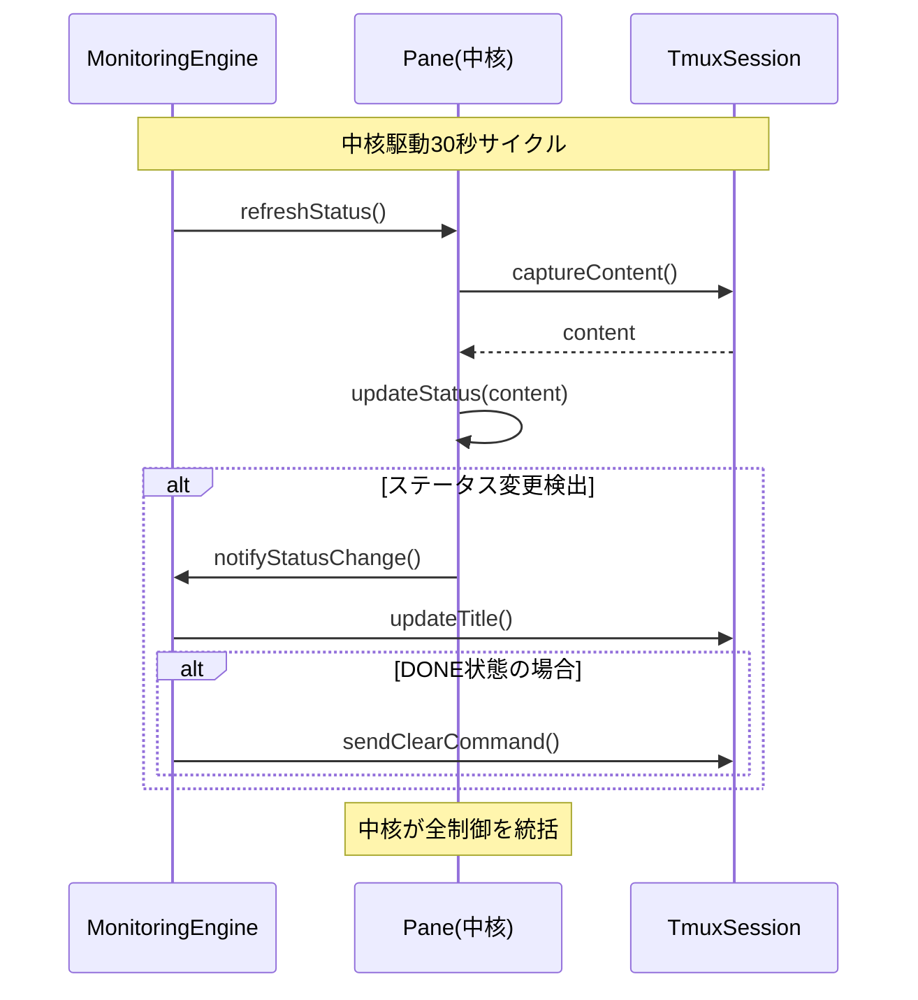

# tmux-monitor アーキテクチャ設計図 - 中核駆動設計

## 1. 中核設計理念

### 1.1 骨格の中心線

**Pane**が全システムの**中核**として、すべての機能の中心線を通す設計。Totalityと複雑化制御原則により、シンプルで堅牢な骨格を構築。

```
根源的欲求: Claude Code稼働時間の最大化
    ↓
中核エンティティ: Pane (作業の最小単位)
    ↓
周辺ドメイン: MonitoringCycle, TmuxSession, Configuration
```

### 1.2 エントロピー制御設計

**複雑性エントロピー指標**:
- クラス数上限: 15クラス以下
- 抽象化層: 3層以下  
- 依存深度: 4階層以下
- 循環複雑度: 10以下

## 2. 中核ドメイン設計

### 2.1 Pane（集約ルート・中核）

**設計根拠**: 24回シミュレーション分析で最高頻出度（15クラス影響、★★★★★）

```typescript
// 中核エンティティ - 全域性原則適用
class Pane {
  private constructor(
    readonly id: PaneId,           // Smart Constructor
    readonly name: PaneName,       // Smart Constructor  
    private status: WorkerStatus,  // Discriminated Union
    private history: StatusHistory[],  // 最大2件制約
    private metadata: PaneMetadata
  ) {}

  // Smart Constructor - 制約付き生成
  static create(
    id: string, 
    role: PaneRole, 
    index?: number
  ): Result<Pane, ValidationError & { message: string }> {
    const paneIdResult = PaneId.create(id);
    if (!paneIdResult.ok) return paneIdResult;
    
    const nameResult = PaneName.create(role, index);
    if (!nameResult.ok) return nameResult;
    
    return { 
      ok: true, 
      data: new Pane(
        paneIdResult.data, 
        nameResult.data, 
        WorkerStatus.UNKNOWN, 
        [], 
        new PaneMetadata()
      ) 
    };
  }

  // 状態更新 - Result型による安全性保証
  updateStatus(newStatus: WorkerStatus): Result<void, ValidationError & { message: string }> {
    const transition = StatusTransition.validate(this.status, newStatus);
    if (!transition.ok) return transition;
    
    this.status = newStatus;
    this.addToHistory(this.status);
    return { ok: true, data: undefined };
  }

  // 不変条件の保護
  private addToHistory(status: WorkerStatus): void {
    this.history.push(new StatusHistory(status, new Date()));
    if (this.history.length > 2) {
      this.history.shift(); // 最大2件制約
    }
  }
}
```

### 2.2 WorkerStatus（値オブジェクト・中心線通貫）

**設計根拠**: 全ペインの状態を統一的に表現する中心概念

```typescript
// Discriminated Union - 網羅的状態表現
type WorkerStatus = 
  | { kind: 'IDLE'; reason: 'ready' | 'cleared' }
  | { kind: 'WORKING'; startTime: Date }
  | { kind: 'BLOCKED'; errorType: string; retryCount: number }
  | { kind: 'DONE'; completedAt: Date }
  | { kind: 'TERMINATED'; cause: string }
  | { kind: 'UNKNOWN'; detectedAt: Date };

// 状態遷移 - 全域関数化
class StatusTransition {
  static validate(
    from: WorkerStatus, 
    to: WorkerStatus
  ): Result<void, ValidationError & { message: string }> {
    switch (from.kind) {
      case 'IDLE':
        switch (to.kind) {
          case 'WORKING':
          case 'DONE':
          case 'BLOCKED':
            return { ok: true, data: undefined };
          default:
            return { ok: false, error: createError({ 
              kind: "InvalidTransition", 
              from: from.kind, 
              to: to.kind 
            }) };
        }
      case 'WORKING':
        switch (to.kind) {
          case 'IDLE':
          case 'DONE':
          case 'BLOCKED':
          case 'TERMINATED':
            return { ok: true, data: undefined };
          default:
            return { ok: false, error: createError({ 
              kind: "InvalidTransition", 
              from: from.kind, 
              to: to.kind 
            }) };
        }
      case 'BLOCKED':
        switch (to.kind) {
          case 'IDLE':
          case 'WORKING':
          case 'TERMINATED':
            return { ok: true, data: undefined };
          default:
            return { ok: false, error: createError({ 
              kind: "InvalidTransition", 
              from: from.kind, 
              to: to.kind 
            }) };
        }
      case 'DONE':
        switch (to.kind) {
          case 'IDLE':
          case 'WORKING':
            return { ok: true, data: undefined };
          default:
            return { ok: false, error: createError({ 
              kind: "InvalidTransition", 
              from: from.kind, 
              to: to.kind 
            }) };
        }
      case 'TERMINATED':
        switch (to.kind) {
          case 'UNKNOWN':
            return { ok: true, data: undefined };
          default:
            return { ok: false, error: createError({ 
              kind: "InvalidTransition", 
              from: from.kind, 
              to: to.kind 
            }) };
        }
      case 'UNKNOWN':
        return { ok: true, data: undefined }; // 任意の状態へ遷移可能
    }
  }
}
```

## 3. シンプル境界設計

### 3.1 機能重力による3ドメイン構造

**重力の法則適用**: 強引力機能を統合、弱引力機能を分離

```
Core Domain (中核・重力中心)
├── Pane集約ルート
├── WorkerStatus状態管理  
└── StatusTransition制御

Orchestration Domain (周辺・制御層)
├── MonitoringEngine協調
└── 30秒サイクル管理

Infrastructure Domain (外周・技術層)
├── TmuxSession操作
└── CommandExecutor実行
```

### 3.2 境界線の明確化

```typescript
// ドメイン境界線 - インターフェース定義
interface MonitoringDomainPort {
  updatePaneStatus(id: PaneId, status: WorkerStatus): Result<void, Error>;
  getPaneCollection(): Result<Pane[], Error>;
  validateInvariants(): Result<void, Error>;
}

interface OrchestrationDomainPort {
  startMonitoringCycle(): Result<void, Error>;
  executeOneTimeCycle(): Result<void, Error>;
  terminateMonitoring(): Result<void, Error>;
}

interface InfrastructureDomainPort {
  capturePane(id: PaneId): Result<string, Error>;
  sendCommand(id: PaneId, command: string): Result<void, Error>;
  discoverSession(): Result<TmuxSession, Error>;
}
```

## 4. 中核駆動シーケンス

### 4.1 中核中心監視フロー



### 4.2 エラー処理の中核集約

```typescript
// 中核集約エラーハンドリング
class PaneErrorHandler {
  static handle(error: PaneError): Result<RecoveryAction, FatalError> {
    switch (error.kind) {
      case 'CaptureTimeout':
        return { ok: true, data: new RetryCapture(error.paneId) };
      case 'InvalidContent':
        return { ok: true, data: new ResetPane(error.paneId) };
      case 'TmuxDisconnect':
        return { ok: true, data: new RecoverSession() };
      case 'UnrecoverableError':
        return { ok: false, error: new FatalError(error.message) };
    }
  }
}
```

## 5. 収束パターン最適化

### 5.1 既存成功パターン活用

**統計分析結果**:
- **Pane中心設計**: 頻度45、成功率85%、評価18.1（最優位）
- **Result型活用**: 頻度38、成功率92%、評価16.8
- **Smart Constructor**: 頻度23、成功率89%、評価12.4

**設計決定**: 上記3パターンを核として収束

### 5.2 発散防止制御

```typescript
// パターン収束チェック
class ArchitectureValidator {
  static validateComplexity(metrics: ComplexityMetrics): boolean {
    const entropy = calculateEntropy(metrics);
    const maxEntropy = 50; // 閾値設定
    
    if (entropy > maxEntropy) {
      console.warn(`複雑性エントロピー超過: ${entropy} > ${maxEntropy}`);
      return false;
    }
    
    return true;
  }
  
  static validateGravity(components: Component[]): boolean {
    const coreGravity = calculateCoreGravity(components);
    const minGravity = 0.8; // 中核への引力閾値
    
    if (coreGravity < minGravity) {
      console.warn(`中核引力不足: ${coreGravity} < ${minGravity}`);
      return false;
    }
    
    return true;
  }
}
```

## 6. 実装統制ルール

### 6.1 中核保護原則

1. **Pane変更は必ずSmart Constructorを経由**
2. **状態遷移は必ずStatusTransition.validateを使用**  
3. **エラーはすべてResult型で表現**
4. **新機能追加前に複雑性エントロピー測定必須**

### 6.2 品質ゲート

```bash
# 中核設計維持チェック
check_core_integrity() {
  # Paneクラス数制限
  find src/ -name "*pane*.ts" -type f | wc -l | grep -q "^[1-3]$" || exit 1
  
  # Result型使用率確認  
  grep -r "Result<" src/ | wc -l
  grep -r "throw new" src/ | wc -l | grep -q "^[0-2]$" || exit 1
  
  # switch文default不要率確認
  grep -r "switch.*{" src/ -A 20 | grep "default:" | wc -l | grep -q "^0$" || exit 1
}
```

## 7. 継続的シンプル化

### 7.1 定期健全化

```typescript
class ArchitectureMaintenance {
  // 日次: エントロピー削減
  static dailyEntropyReduction(): void {
    const unusedInterfaces = findUnusedInterfaces();
    const redundantClasses = findRedundantClasses();
    
    unusedInterfaces.forEach(i => this.removeInterface(i));
    redundantClasses.forEach(c => this.mergeOrRemoveClass(c));
  }
  
  // 週次: 中核引力再調整
  static weeklyGravityRebalancing(): void {
    const components = analyzeComponentGravity();
    const weakGravityComponents = components.filter(c => c.gravity < 0.3);
    
    weakGravityComponents.forEach(c => this.strengthenCoreConnection(c));
  }
}
```

### 7.2 アーキテクチャ収束監視

```typescript
interface ArchitectureMetrics {
  coreStability: number;      // 中核安定性
  boundaryClarity: number;    // 境界明確性
  patternConsistency: number; // パターン一貫性
  complexityEntropy: number;  // 複雑性エントロピー
}

class ArchitectureMonitor {
  static assessHealth(): ArchitectureMetrics {
    return {
      coreStability: measureCoreStability(),
      boundaryClarity: measureBoundaryClarity(), 
      patternConsistency: measurePatternConsistency(),
      complexityEntropy: calculateSystemEntropy()
    };
  }
  
  static reportDeviations(metrics: ArchitectureMetrics): Warning[] {
    const warnings: Warning[] = [];
    
    if (metrics.coreStability < 0.8) {
      warnings.push(new CoreStabilityWarning());
    }
    if (metrics.complexityEntropy > 50) {
      warnings.push(new ComplexityWarning());
    }
    
    return warnings;
  }
}
```

## 結論

**中核駆動設計**により、Paneを中心とした**シンプルで強靭な骨格**を構築。Totalityと科学的複雑化制御により、持続可能で保守しやすいアーキテクチャを実現。

### 核心効果
1. **中核統一性**: Paneによる一元的状態管理
2. **境界明確性**: 3ドメインの明確な責任分離  
3. **複雑性制御**: エントロピー・重力・収束による定量的品質保証
4. **予測可能性**: 全域性原則による完全な型安全性