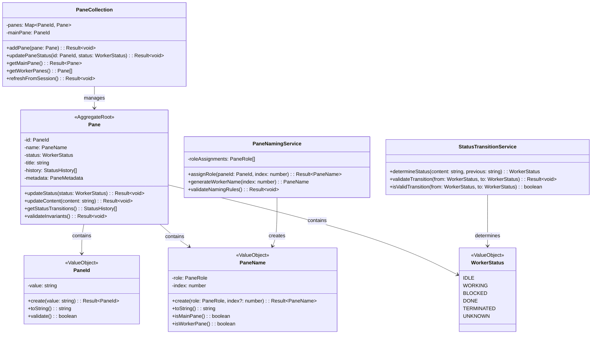

# tmux-monitor アーキテクチャ設計図

## 1. システム概要

### 1.1 アーキテクチャ概観


## 2. シーケンス図

### 2.1 監視サイクル実行シーケンス


### 2.2 ペイン状態更新シーケンス


### 2.3 予約実行・指示書送信シーケンス


## 3. クラス図

### 3.1 Monitoring Domain クラス構造



### 3.2 Orchestration Domain クラス構造


### 3.3 Infrastructure Domain クラス構造


## 4. 状態図

### 4.1 WorkerStatus 状態遷移図


### 4.2 監視サイクル状態遷移図


### 4.3 ペインライフサイクル状態図


## 5. コンポーネント図

### 5.1 ドメイン境界コンポーネント図


## 6. デプロイメント図

### 6.1 実行環境構成図

```mermaid
graph TB
    subgraph "Development Environment"
        subgraph "Local Machine"
            subgraph "Deno Runtime"
                APP[tmux-monitor CLI]
            end
            subgraph "tmux Session"
                MAIN[Main Pane]
                MGR1[Manager1 Pane]
                MGR2[Manager2 Pane]
                SEC[Secretary Pane]
                WK1[Worker1 Pane]
                WK2[Worker2 Pane]
                WKN[Worker N Panes...]
            end
            subgraph "File System"
                INST[Instruction Files]
                LOG_FILE[Log Files]
                CONFIG[Config Files]
            end
        end
    end
    
    subgraph "CI/CD Environment"
        subgraph "GitHub Actions"
            TEST[Test Runner]
            BUILD[Build Process]
            DEPLOY[JSR Deploy]
        end
    end
    
    subgraph "Distribution"
        JSR[JSR Registry]
        NPM[npm Registry]
    end
    
    APP --> MAIN : 指示送信
    APP --> MGR1 : 状態報告
    APP --> MGR2 : 状態報告  
    APP --> SEC : 補助作業
    APP --> WK1 : /clear送信
    APP --> WK2 : /clear送信
    APP --> WKN : /clear送信
    
    APP --> INST : 読み込み
    APP --> LOG_FILE : 出力
    APP --> CONFIG : 読み込み
    
    TEST --> APP : テスト実行
    BUILD --> JSR : パッケージ公開
    DEPLOY --> NPM : 配布
```

## 7. 通信プロトコル詳細

### 7.1 イベント駆動通信フロー


### 7.2 エラーハンドリングフロー


この設計図により、tmux-monitorのアーキテクチャ全体が可視化され、要求事項とドメイン境界設計が統合された包括的な設計仕様として活用できます。