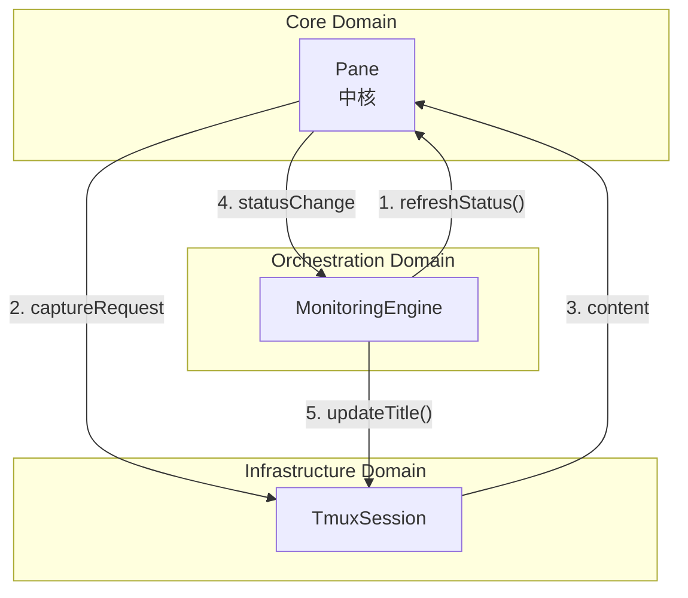

# tmux-monitor ドメイン境界線設計 - 中核駆動型

## 中核思想

**Pane**を中心とした**3ドメイン構造**により、シンプルで明確な境界線を定義。機能重力の法則に基づき、強引力機能を統合、弱引力機能を分離。

```
根源的欲求: Claude Code稼働時間の最大化
    ↓
中核: Pane (すべての制御の起点)
    ↓
境界: Core → Orchestration → Infrastructure
```

## 3ドメイン境界設計

### 1. **Core Domain**（中核・重力中心）
**役割**: Paneを中心とした状態管理と不変条件の保護

#### 境界内要素
```typescript
// 中核エンティティ
- Pane (集約ルート・全制御の起点)
  └── PaneId (値オブジェクト・%\d+制約)
  └── PaneName (値オブジェクト・役割制約)
  └── WorkerStatus (値オブジェクト・状態表現)
  └── StatusHistory[] (履歴・最大2件)

// 中核サービス
- StatusTransition (状態遷移制御)
- PaneErrorHandler (エラー集約処理)
```

#### 不変条件
- PaneIDはtmux形式（%\d+）でなければならない
- 状態遷移は必ずStatusTransition.validateを経由
- 履歴は最大2件まで保持
- すべてのエラーはResult型で表現

#### 境界インターフェース
```typescript
interface CoreDomainPort {
  // Pane操作
  createPane(id: string, role: PaneRole): Result<Pane, ValidationError>;
  updatePaneStatus(pane: Pane, status: WorkerStatus): Result<void, ValidationError>;
  
  // 状態検証
  validateStatusTransition(from: WorkerStatus, to: WorkerStatus): Result<void, ValidationError>;
  
  // エラー処理
  handlePaneError(error: PaneError): Result<RecoveryAction, FatalError>;
}
```

### 2. **Orchestration Domain**（周辺・制御層）
**役割**: 監視サイクルの管理と中核への指示

#### 境界内要素
```typescript
// 制御エンティティ
- MonitoringEngine (監視全体の調整)
- MonitoringCycle (30秒サイクル管理)

// 最小限のサービス
- CycleScheduler (サイクル実行制御)
```

#### 不変条件
- 監視サイクルは30秒間隔で実行
- 同時実行可能なサイクルは1つのみ
- 中核への操作は必ずCoreDomainPort経由

#### 境界インターフェース
```typescript
interface OrchestrationDomainPort {
  startMonitoringCycle(): Result<void, Error>;
  executeOneTimeCycle(): Result<void, Error>;
  terminateMonitoring(): Result<void, Error>;
}
```

### 3. **Infrastructure Domain**（外周・技術層）
**役割**: tmuxとの通信と技術的詳細の隠蔽

#### 境界内要素
```typescript
// 技術的実装
- TmuxSession (tmux操作の抽象化)
- CommandExecutor (コマンド実行)

// 最小限のアダプター
- PaneCapture (内容取得)
```

#### 不変条件
- tmuxコマンド実行は例外安全
- 技術的詳細は中核から完全に隠蔽
- すべての結果はResult型で返却

#### 境界インターフェース
```typescript
interface InfrastructureDomainPort {
  capturePane(id: PaneId): Result<string, Error>;
  sendCommand(id: PaneId, command: string): Result<void, Error>;
  discoverSession(): Result<TmuxSession, Error>;
}
```

## 境界間通信プロトコル

### 中核中心の単方向フロー



### メッセージ型定義

```typescript
// 中核駆動メッセージ
type CoreMessage = 
  | { type: 'StatusChanged'; pane: Pane; from: WorkerStatus; to: WorkerStatus }
  | { type: 'ErrorOccurred'; error: PaneError; recovery: RecoveryAction }
  | { type: 'InvariantViolated'; violation: string };

// 制御層メッセージ  
type OrchestrationMessage =
  | { type: 'CycleStarted'; cycleId: string }
  | { type: 'CycleCompleted'; cycleId: string; duration: number };

// 技術層メッセージ
type InfrastructureMessage =
  | { type: 'CaptureCompleted'; paneId: PaneId; content: string }
  | { type: 'CommandExecuted'; paneId: PaneId; command: string };
```

## 境界保護メカニズム

### 1. 型レベル境界強制

```typescript
// 境界を越えられない型定義
namespace Core {
  export interface Pane {
    readonly id: PaneId;
    readonly status: WorkerStatus;
    // privateメソッドで内部状態を保護
  }
}

// 境界専用の変換関数
function toCoreMessage(external: any): Result<CoreMessage, ValidationError> {
  // 厳密な検証と変換
}
```

### 2. 依存方向の強制

```typescript
// 依存性注入による単方向制御
class DIContainer {
  // Core → なし（依存ゼロ）
  registerCore(): void {
    this.register('StatusTransition', StatusTransition);
    this.register('PaneErrorHandler', PaneErrorHandler);
  }
  
  // Orchestration → Core
  registerOrchestration(): void {
    this.register('MonitoringEngine', MonitoringEngine, ['CoreDomainPort']);
  }
  
  // Infrastructure → Core
  registerInfrastructure(): void {
    this.register('TmuxSession', TmuxSession, ['CoreDomainPort']);
  }
}
```

### 3. 境界違反の自動検出

```typescript
class BoundaryValidator {
  static validateArchitecture(): ValidationResult {
    const violations = [];
    
    // Core層の独立性チェック
    if (hasExternalDependency('Core')) {
      violations.push('Core domain has external dependencies');
    }
    
    // 逆方向依存チェック
    if (hasCyclicDependency()) {
      violations.push('Cyclic dependency detected');
    }
    
    return { valid: violations.length === 0, violations };
  }
}
```

## エントロピー制御指標

### 境界複雑性メトリクス

```typescript
interface BoundaryMetrics {
  domainCount: 3;           // 固定（増加禁止）
  interfaceCount: 3;        // 最小限維持
  messageTypes: 9;          // 上限設定
  crossBoundaryMethods: 10; // 削減目標
}

// 境界健全性スコア
function calculateBoundaryHealth(metrics: BoundaryMetrics): number {
  const simplicityScore = 1 / (metrics.interfaceCount * metrics.messageTypes);
  const isolationScore = 1 - (metrics.crossBoundaryMethods / 20);
  return (simplicityScore + isolationScore) / 2;
}
```

## 結論

**中核駆動の3ドメイン構造**により、Paneを中心とした**明確で単純な境界線**を実現。各ドメインの責任が明確で、依存関係が単方向に制御され、複雑性の増大を防ぐ設計。

### 核心効果
1. **境界明確性**: 3ドメインのみのシンプル構造
2. **依存単純性**: Core → Orchestration → Infrastructure の単方向フロー
3. **中核保護**: Paneの不変条件を境界で完全保護
4. **拡張容易性**: 新機能は適切なドメインに配置するだけ